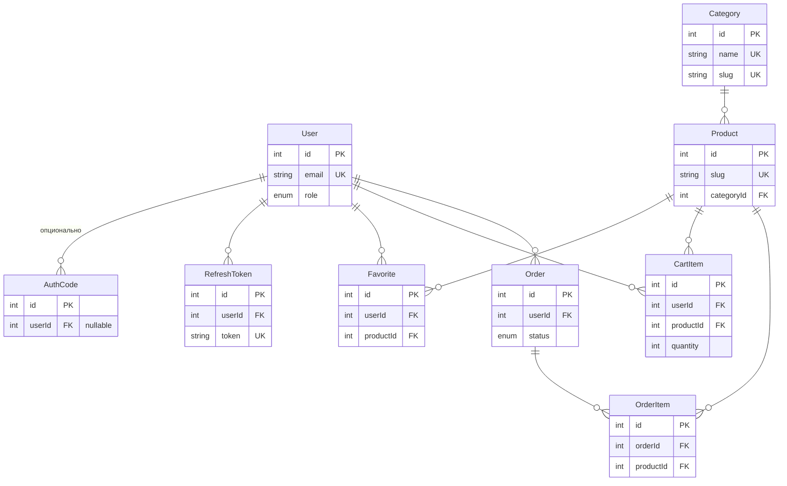

# Схема БД (связи)

Источник правды — [`schema.prisma`](./schema.prisma). Ниже — визуализация для обсуждений и онбординга.

## Зоны (логические блоки)

| Зона | Модели | Назначение |
|------|--------|------------|
| **Аккаунт** | `User` | Профиль, роль, лояльность |
| **Авторизация** | `AuthCode`, `RefreshToken` | Код входа, сессии JWT |
| **Каталог** | `Category`, `Product` | Иерархия категорий и карточки товаров |
| **Избранное / корзина** | `Favorite`, `CartItem` | Персональные списки до оформления заказа |
| **Заказы** | `Order`, `OrderItem` | Оформленный заказ и позиции (снимок цены в `unitPrice`) |

---

## Связи (сводная таблица)

| От модели | К модели | Тип | `onDelete` | Комментарий |
|-----------|----------|-----|------------|-------------|
| `User` | `AuthCode` | 1 → N | `SET NULL` | `userId` может быть `NULL` |
| `User` | `RefreshToken` | 1 → N | `CASCADE` | |
| `User` | `Favorite` | 1 → N | `CASCADE` | |
| `User` | `CartItem` | 1 → N | `CASCADE` | |
| `User` | `Order` | 1 → N | `RESTRICT` | |
| `Category` | `Product` | 1 → N | `RESTRICT` | |
| `Product` | `Favorite` | 1 → N | `CASCADE` | |
| `Product` | `CartItem` | 1 → N | `CASCADE` | |
| `Product` | `OrderItem` | 1 → N | `RESTRICT` | нельзя удалить товар из истории заказов |
| `Order` | `OrderItem` | 1 → N | `CASCADE` | |

---

## Модели и поля

### `User`

| Поле | Тип | Обязательно | Ключ / индекс | Описание |
|------|-----|-------------|---------------|----------|
| `id` | `INT` | да | **PK**, автоинкремент | |
| `email` | `VARCHAR` | да | **UNIQUE** | |
| `firstName` | `VARCHAR` | нет | | |
| `lastName` | `VARCHAR` | нет | | |
| `phone` | `VARCHAR` | нет | | |
| `dateOfBirth` | `DATETIME` | нет | | |
| `role` | `ENUM` (`USER` / `ADMIN`) | да | default `USER` | |
| `loyaltyPoints` | `INT` | да | default `0` | |
| `createdAt` | `DATETIME` | да | | |
| `updatedAt` | `DATETIME` | да | автообновление | |

### `AuthCode`

| Поле | Тип | Обязательно | Ключ / индекс | Описание |
|------|-----|-------------|---------------|----------|
| `id` | `INT` | да | **PK** | |
| `email` | `VARCHAR` | да | индекс `(email, createdAt)` | |
| `code` | `VARCHAR` | да | | одноразовый код |
| `expiresAt` | `DATETIME` | да | | |
| `usedAt` | `DATETIME` | нет | | когда погашен |
| `createdAt` | `DATETIME` | да | | |
| `userId` | `INT` | нет | **FK** → `User.id` | |

### `RefreshToken`

| Поле | Тип | Обязательно | Ключ / индекс | Описание |
|------|-----|-------------|---------------|----------|
| `id` | `INT` | да | **PK** | |
| `token` | `VARCHAR` | да | **UNIQUE** | |
| `userId` | `INT` | да | **FK** → `User.id` | |
| `createdAt` | `DATETIME` | да | | |
| `expiresAt` | `DATETIME` | да | | |

### `Category`

| Поле | Тип | Обязательно | Ключ / индекс | Описание |
|------|-----|-------------|---------------|----------|
| `id` | `INT` | да | **PK** | |
| `name` | `VARCHAR` | да | **UNIQUE** | |
| `slug` | `VARCHAR` | да | **UNIQUE** | |
| `description` | `VARCHAR` / `TEXT` | нет | | |
| `createdAt` | `DATETIME` | да | | |
| `updatedAt` | `DATETIME` | да | | |

### `Product`

| Поле | Тип | Обязательно | Ключ / индекс | Описание |
|------|-----|-------------|---------------|----------|
| `id` | `INT` | да | **PK** | |
| `name` | `VARCHAR` | да | | |
| `slug` | `VARCHAR` | да | **UNIQUE** | |
| `subcategory` | `VARCHAR` | нет | | |
| `description` | `TEXT` | нет | | |
| `usage` | `TEXT` | нет | | |
| `manufacturer` | `VARCHAR` | нет | | |
| `activeComponents` | `VARCHAR` | нет | | |
| `weightGr` | `INT` | нет | | |
| `country` | `VARCHAR` | нет | | |
| `barcode` | `VARCHAR` | нет | | |
| `characteristics` | `TEXT` | нет | | |
| `composition` | `TEXT` | нет | | |
| `tabLabelDescription` | `VARCHAR` | нет | | подпись вкладки |
| `tabLabelCharacteristics` | `VARCHAR` | нет | | |
| `tabLabelComposition` | `VARCHAR` | нет | | |
| `price` | `DECIMAL(10,2)` | да | | |
| `stock` | `INT` | да | default `0` | остаток |
| `imageUrl` | `VARCHAR` | нет | | |
| `isPublished` | `BOOLEAN` | да | default `true` | |
| `categoryId` | `INT` | да | **FK** → `Category.id` | |
| `createdAt` | `DATETIME` | да | | |
| `updatedAt` | `DATETIME` | да | | |

### `Favorite`

| Поле | Тип | Обязательно | Ключ / индекс | Описание |
|------|-----|-------------|---------------|----------|
| `id` | `INT` | да | **PK** | |
| `userId` | `INT` | да | **FK** → `User.id` | |
| `productId` | `INT` | да | **FK** → `Product.id` | |
| `createdAt` | `DATETIME` | да | | |
| — | — | — | **UNIQUE** `(userId, productId)` | одна запись на пару |

### `CartItem`

| Поле | Тип | Обязательно | Ключ / индекс | Описание |
|------|-----|-------------|---------------|----------|
| `id` | `INT` | да | **PK** | |
| `userId` | `INT` | да | **FK** → `User.id` | |
| `productId` | `INT` | да | **FK** → `Product.id` | |
| `quantity` | `INT` | да | default `1` | |
| `createdAt` | `DATETIME` | да | | |
| `updatedAt` | `DATETIME` | да | | |
| — | — | — | **UNIQUE** `(userId, productId)` | одна строка корзины на товар |

### `Order`

| Поле | Тип | Обязательно | Ключ / индекс | Описание |
|------|-----|-------------|---------------|----------|
| `id` | `INT` | да | **PK** | |
| `userId` | `INT` | да | **FK** → `User.id` | |
| `status` | `ENUM` (`NEW` … `CANCELLED`) | да | default `NEW` | |
| `fullName` | `VARCHAR` | да | | снимок на момент заказа |
| `email` | `VARCHAR` | да | | |
| `phone` | `VARCHAR` | да | | |
| `city` | `VARCHAR` | да | | |
| `addressLine` | `VARCHAR` | да | | |
| `apartment` | `VARCHAR` | нет | | |
| `entrance` | `VARCHAR` | нет | | |
| `intercom` | `VARCHAR` | нет | | |
| `floor` | `VARCHAR` | нет | | |
| `promoCode` | `VARCHAR` | нет | | |
| `comment` | `VARCHAR` / `TEXT` | нет | | |
| `totalAmount` | `DECIMAL(10,2)` | да | | итог заказа |
| `createdAt` | `DATETIME` | да | | |
| `updatedAt` | `DATETIME` | да | | |

### `OrderItem`

| Поле | Тип | Обязательно | Ключ / индекс | Описание |
|------|-----|-------------|---------------|----------|
| `id` | `INT` | да | **PK** | |
| `orderId` | `INT` | да | **FK** → `Order.id` | |
| `productId` | `INT` | да | **FK** → `Product.id` | |
| `quantity` | `INT` | да | | |
| `unitPrice` | `DECIMAL(10,2)` | да | | цена за единицу на момент заказа |
| `createdAt` | `DATETIME` | да | | |

---

## Диаграмма связей (Mermaid)

В Cursor / VS Code: превью Markdown. На GitHub диаграмма рендерится сама.

## Ограничения, которые важно помнить

- **Уникальность пар**: `Favorite` и `CartItem` — `@@unique([userId, productId])` (один ряд на пару пользователь–товар).
- **Удаление**: у `OrderItem` связь с `Product` — `onDelete: Restrict` (нельзя удалить товар, если он фигурирует в заказах); у `Product` с `Category` — `Restrict`; у пользовательских сущностей к `User`/`Product` в избранном и корзине — `Cascade`.
- **Заказ** хранит контактные поля и адрес **снимком** на момент оформления; позиции — `quantity` + `unitPrice` на строку.

## Как обновлять

После изменений в `schema.prisma` синхронизируй: зоны, **сводную таблицу связей**, **таблицы полей** и блок Mermaid.
